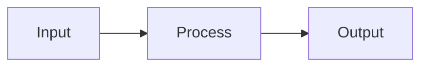

# Style and Best Practices

This repository documents shared conventions used across projects. Individual
repositories should reference this as the canonical source.

## General

### Makefiles

Every project should have a `Makefile` as the standard entry point for common
tasks: building, testing, linting, formatting, and running. Prefer `make`
targets over documenting raw commands. This gives contributors a single
interface regardless of the underlying toolchain.

Typical targets:

- `make build`
- `make test`
- `make lint`
- `make fmt`
- `make run`

### Unicode

Non-ASCII characters are welcome in documentation, comments, and even variable
names where they improve clarity—for example, en dashes, em dashes, Greek
letters (`θ`, `λ`), and mathematical symbols. Use emoji sparingly.

### Version policy

Always use the latest stable version of languages, tools, and dependencies. Do
not pin to older versions without a specific, documented reason.

## Git

### Commit messages

Do not use Conventional Commits prefixes (`fix:`, `feat:`, `chore:`, etc.).
Write plain imperative sentences. Follow the conventions in the
[English](#english) section for prose style.

## Languages

- [Python](python.md) — uv, Ruff, ty
- [Go](go.md) — `go tool`, gofumpt, golangci-lint
- [TypeScript/JavaScript](typescript.md) — Bun, ESLint, typescript-eslint

## Containers

See [containers.md](containers.md) for container image conventions, including
Distroless base images and ko for Go.

## English

Follow the [Chicago Manual of Style](https://www.chicagomanualofstyle.org/) for
prose, documentation, and commit messages. Notable conventions:

- Use the serial (Oxford) comma.
- Titles and headings use sentence case, not title case.
- Spell out numbers under 100 in running text.
- Use an em dash (—) without surrounding spaces.

## Markdown

### Formatting

Use [Prettier](https://prettier.io/) to format Markdown files.

### Diagrams

Use [Mermaid](https://mermaid.js.org/) for diagrams instead of ASCII art.
Mermaid renders natively on GitHub and in most documentation tools, and is far
easier to maintain than hand-drawn text diagrams.

````markdown

````
