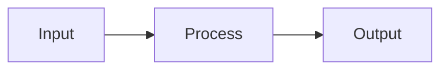

<!--
Copyright © 2026 Michael Shields

Licensed under the Apache License, Version 2.0 (the "License");
you may not use this file except in compliance with the License.
You may obtain a copy of the License at

    http://www.apache.org/licenses/LICENSE-2.0

Unless required by applicable law or agreed to in writing, software
distributed under the License is distributed on an "AS IS" BASIS,
WITHOUT WARRANTIES OR CONDITIONS OF ANY KIND, either express or implied.
See the License for the specific language governing permissions and
limitations under the License.
-->

# Style and best practices

This repository documents shared conventions used across projects. Individual
repositories should reference this as the canonical source.

## Agents

Agent instructions live in `AGENTS.md`. `CLAUDE.md` is a symlink to it until
Claude Code supports `AGENTS.md` natively
([anthropics/claude-code#6235](https://github.com/anthropics/claude-code/issues/6235)).

## General

### Makefiles

Every project should have a `Makefile` as the standard entry point for common
tasks: building, testing, linting, formatting, and running. Prefer `make`
targets over documenting raw commands.

Typical targets:

- `make build`
- `make test`
- `make lint`
- `make fmt`
- `make run`

`make lint` and `make fmt` should cover everything in the project, including
non-code files such as Markdown, JSON, YAML, and TOML.

### Git hooks

Use [Lefthook](https://lefthook.dev/) for git hooks. Single Go binary, no
runtime dependency. The convention is one hook, one command:

```yaml
pre-commit:
  commands:
    lint:
      run: make lint
```

All format and lint logic lives in the Makefile, so local commits and CI run the
same command. If `make lint` fails, run `make fmt` and re-stage. Don't pass
`--no-verify`.

### Unicode

Non-ASCII characters are welcome in documentation, comments, and even variable
names where they improve clarity — for example, en dashes, em dashes, Greek
letters (`θ`, `λ`), and mathematical symbols. Use emoji sparingly.

### Version policy

Always use the latest stable version of languages, tools, and dependencies. Do
not pin to older versions without a specific, documented reason.

### Commit messages

Do not use Conventional Commits prefixes (`fix:`, `feat:`, `chore:`, etc.).
Write plain imperative sentences. Follow the conventions in the
[English](#english) section for prose style.

## Languages

- [Python](python.md) — uv, Ruff, ty
- [Go](go.md) — `go tool`, gofumpt, golangci-lint
- [Rust](rust.md) — edition 2024, strict Clippy, llvm-cov
- [Swift](swift.md) — Swift 6.3, SwiftPM, swift-format, Swift Testing
- [TypeScript/JavaScript](typescript.md) — Bun, ESLint, typescript-eslint

## CI

See [ci.md](ci.md) for GitHub Actions and Renovate conventions.

## Containers

See [containers.md](containers.md) for container image conventions, including
Distroless base images and ko for Go.

## English

Follow the [Chicago Manual of Style](https://www.chicagomanualofstyle.org/) for
prose, documentation, and commit messages. Notable conventions:

- Use the serial (Oxford) comma.
- Titles and headings use sentence case, not title case.
- Spell out numbers under 100 in running text.
- Use an em dash (—) without surrounding spaces; in code comments, surround it
  with spaces.
- Write "Wi-Fi", not "WiFi".
- Write "naïve" with a diaeresis, not "naive".
- Use "allowlist" and "denylist", not "whitelist" and "blacklist". Applies to
  prose and to code identifiers.

## HTML

### Typography

- Use curly quotes (“ ” ‘ ’), not straight quotes.
- Use en dashes (–) for ranges.
- Use the minus sign (−, U+2212) for negative numbers and subtraction, not a
  hyphen.
- Use a narrow no-break space (U+202F) between a number and its unit, for
  example, “12 km”.

### Math

Use [MathML](https://developer.mozilla.org/en-US/docs/Web/MathML) for
mathematical notation instead of MathJax, KaTeX, or images. MathML renders
natively in all modern browsers without JavaScript.

## Markdown

Markdown for human readers, which will be rendered to HTML, follows the
[HTML](#html) conventions. Markdown for agents (`AGENTS.md`, `CLAUDE.md`,
everything in this repository) is treated like code comments.

### Formatting

Use [Prettier](https://prettier.io/) to format Markdown. Prettier handles JSON
and YAML natively; add
[`prettier-plugin-toml`](https://github.com/un-ts/prettier/tree/master/packages/toml)
so the same run also formats TOML, such as [`.ruff.toml`](.ruff.toml) and
[`bunfig.toml`](bunfig.toml).

### Diagrams

Use [Mermaid](https://mermaid.js.org/) for diagrams instead of ASCII art.
Mermaid renders natively on GitHub and in most documentation tools.

````markdown

```mermaid
graph LR
    A[Input] --> B[Process]
    B --> C[Output]
```
````
